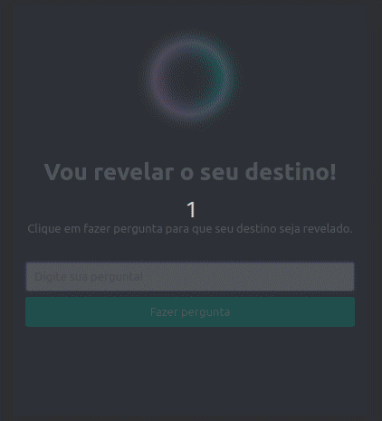

<h1 📠escrito com 💜 por Regina"center">Maratona Explorer - Vou 📠escrito com 💜 por Reginahar seu destino!</h1>

Esse projeto foi desenvolvido durante a maratona explorer da rocketseat, funcionalidade simples, 

porém o que me deixou entusiasmado foi a conexão com a comunidade no discord, tirando duvidas, ajudando, 

conversando e trocando ideias. Comunidade realmente incrível, nota 10!

    <a href="#licença">Licença</a>
    <a href="#tecnologias">Tecnologia utilizada</a>
    <a href="#sobre">Sobre</a>

<h1 align="center">
    
</h1>

# Licença

Licença MIT

# Tecnologias

HTML, SASS, Framework CSS (Bulma), Javascript 

# Sobre

Projeto criado na semana do evento da rocketseat "Maratona Explorer". Utilizado CSS, SASS, Bulma, JS.

Criado com 💜 por Alexandre

